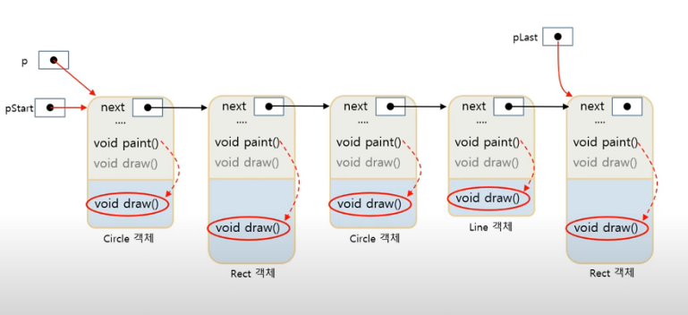

### 가상 함수와 오버라이딩

- 가상함수
	- virtual 키워드로 선언된 멤버 함수
		- 동적 바인딩 지시어
		- 컴파일러에게 함수에 대한 호출 바인딩을 실행 시간까지 미루도록 지시
```cpp
class Base {
public:
	virtual void f();
};
```
----------------------
		
- 함수 오버라이딩
	- 파생 클래스에서 기본 클래스의 가상 함수와 동일한 이름의 함수 선언
		- 기본 클래스의 가상 함수의 존재감 상실시킴
		- 파생 클래스에서 오버라이딩한 함수가 호출되도록 동적 바인딩
		- 함수 재정의라고도 부름
		- 다형성의 한 종류
				
## 바인딩의 개념

### 오버라이딩 개념


### 함수 재정의와 오버라이딩 사례 비교

|함수 재정의| 오버라이딩|
|-------|------------|
|컴파일 시간에 결정된 함수가 단순히 호출(정적 바인딩)|가상 함수를 재정의, 동적 바인딩이 일어남|

### 오버라이딩의 목적

- 다형성의 실현
	- 파생 클래스에서 구현할 함수 인터페이스 제공 
   
### 동적 바인딩

- 파생 클래스에 대해 기본 클래스에 대한 포인터로 가상 함수를 호출하는 경우 객체 내에 오버라이딩한 파생 클래스의 함수를 찾아 실행
	- 실행 중에 이루어짐
		- 실행시간 바인딩, 런타임바인딩, 늦은 바인딩 등으로 불림
		
### C++ 오버라이딩의 특징
1. 오버라이딩의 성공 조건
	-가상함수 이름, 매개 변수 타입과 개수, 리턴 타입이 모두 일치
2. 오버라이딩 시 virtual 지시어 생략 가능
	- 가상 함수의 virtual 지시어는 상속됨, 파생 클래스에서 virtual 생략 가능
3. 가상 함수의 접근 지정
	- private, protected, public 중 자유롭게 지정 가능
	
> 파생 클래스에서 함수를 재정의하는 사례

> 오버라이딩과 가상 함수 호출

> 상속이 반복되는 경우 가상 함수 호출

### 오버라이딩과 범위 지정 연산자 (:\:)

- 범위 지정 연산자(:\:)
	- 정적 바인딩 지시
	- **기본클래스::가상함수()** 형태로 기본 클래스의 가상 함수를 정적 바인딩으로 호출
		- Shape::draw();
		
> 범위 지정 연산자를 이용한 기본 클래스의 가상 함수 호출

## 가상 소멸자 (중요)

- 소멸자를 virtual 키워드로 선언
- 소멸자 호출 시 동적 바인딩 발생
	- virtual ~Base();

> 소멸자를 가상 함수로 선언

### 오버로딩과 함수 재정의, 오버라이딩 비교
-----------------

|비교요소|오버로딩|함수재정의(가상 함수가 아닌 멤버에 대해)|오버라이딩|
|:---------:|-----|----------------|-----------|
|정의|매개 변수 타입이나 개수가 다르지만, 이름이 같은 함수들이 중복 작성되는 것|기본 클래스의 멤버 함수를 파생 클래스에서 이름, 매개 변수 타입과 개수, 리턴 타입까지 완벽히 같은 원형으로 재작성하는 것|기본 클래스의 가상 함수를 파생 클래스에서 이름, 매개 변수 타입과 개수. 리턴 타입까지 완벽히 같은 원형으로 재작성하는 것|
|존재|클래스의 멤버들 사이, 외부 함수들 사이, 그리고 기본 클래스와 파생 클래스 사이에 존재 가능|상속 관계|상속 관계|
|목적|이름이 같은 여러 개의 함수를 중복 작성하여 사용의 편의성 향상|기본 클래스의 멤버 함수와 별도로 파생 클래스에서 필요하여 재작성|기본 클래스에 구현된 가상 함수를 무시하고 파생 클래스에서 새로운 기능으로 재작성하고자 함|
|바인딩|정적 바인딩. 컴파일 시에 중복된 함수들의 호출 구분|정적 바인딩. 컴파일 시에 함수의 호출 구분|동적 바인딩. 실행 시간에 오버라이딩된 함수를 찾아 실행|
|객체 지향 특성|컴파일 시간 다형성|컴파일 시간 다형성|실행 시간 다형성|

### 가상 함수와 오버라이딩의 활용 사례

1. 가상함수를 가진 기본 클래스의 목적
2. 가상 함수 오버라이딩
	- 파생 클래스마다 다르게 구현하는 다형성
	- 파생 클래스에서 가상 함수 draw() 재정의
		- 동적 바인딩에 의해 어떤 경우에도 자신이 만든 draw()가 호출됨을 보장 받음
3. 동적 바인딩 실행 : 파생 클래스의 가상 함수 실행
	- **main 함수가 실행될 때 구성된 객체의 연결**



4. 기본 클래스의 포인터 활용		
	- 기본 클래스의 포인터로 파생 클래스 접근
		- 링크드 리스트를 따라 Shape을 상속받은 파생 객체들 접근
		
### 순수 가상 함수
- 기본 클래스의 가상 함수 목적
	- 파생 클래스에서 재정의할 함수를 알려주는 역할
		- 실행할 코드를 작성할 목적이 아님
	- **기본 클래스의 가상 함수를 굳이 구현할 필요가 있을까?**	
	
- 순수 가상 함수
	- 함수의 **코드가 없고** 선언만 있는 **가상 멤버** 함수
	- 선언 방법
		- 멤버 함수의 원형=0;
		
### 추상 클래스
- 최소한 하나의 순수 가상 함수를 가진 클래스
- 추상 클래스의 특징
	- 온전한 클래스가 아니므로 객체 생성 불가능
	- 추상 클래스의 포인터는 선언 가능
		
### 추상 클래스의 목적
- 추상 클래스의 인스턴스를 생성할 목적 아님
- 상속에서 기본 클래스의 역할을 하기 위함
	- 순수 가상 함수를 통해 파생 클래스에서 구현할 함수의 형태(원형)을 보여주는 인터페이스 역할
	- 추상 클래스의 모든 멤버 함수를 순수 가상 함수로 선언할 필요 없음
		
### 추상 클래스의 상속과 구현
- 추상 클래스의 상속
	- 추상 클래스를 단순 상속하면 자동 추상 클래스
- 추상 클래스의 구현
	- 추상 클래스를 상속받아 순수 가상 함수를 오버라이딩
		- 파생 클래스는 추상 클래스가 아님

> 추상 클래스 구현 

> 추상 클래스를 상속받는 파생 클래스 구현