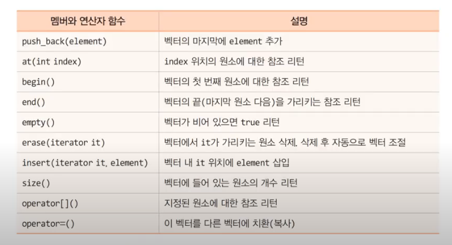
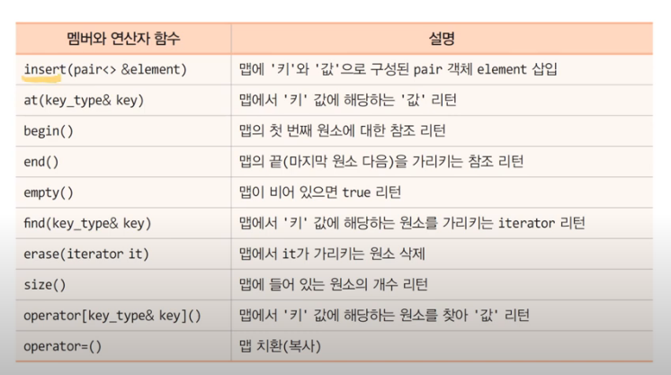

### 템플릿과 표준 템플릿 라이브러리

- 함수 중복의 약점
	- 중복 함수의 코드 중복
	
### 일반화와 템플릿
- 제네릭 또는 일반화
	- 함수나 클래스를 일반회시키고, 매개 변수 타입을 지정하여 틀에서 찍어내듯이 함수나 클래스 코드를 생산하는 기법
	
- 템플릿
	- 함수나 클래스를 일반화하는 C++도구
	- template 키워드로 함수나 클래스 선언
		- 변수나 매개 변수의 타입만 다르고, 코드 부분이 동일한 함수를 일반화시킴
	- 제네릭 타입 - 일반화를 위한 데이터 타입
	
- 템플릿 선언
```cpp
template <class T>
void myswap (T & a, T & b) {
	T tmp;
	tmp = a;
	a = b;
	b = tmp;
}
```

### 구체화
- 템플릿의 제네릭 타입에 구체적인 타입 지정
	- 템플릿 함수로부터 구체화된 함수의 소스 코드 생성
	
> 제네릭 myswap() 함수 만들기

### 구체화 오류
- 제네릭 타입에 구체적인 타입 지정 시 주의

### 템플릿 장점과 제네릭 프로그래밍
- 템플릿 장점
	- 함수 코드의 재사용
		- 높은 소프트웨어의 생산성과 유용성
- 템플릿 단점
	- 포팅에 취약
	- 컴파일 오류 메시지 빈약, 디버깅에 많은 어려움
	
- 제네릭 프로그래밍

> 큰 값을 리턴하는 bigger()

> 배열의 합을 구하는 add() 함수 만들기 (에러가 남)

> 배열을 복사하는 mcopy()

> 중복 함수가 템플릿 함수보다 우선

### 제네릭 클래스 만들기

1. 제네릭 클래스 선언
2. 제네릭 클래스 구현
3. 클래스 구체화 및 객체 활용

> 스택클래스만들기

> 포인터나 클래스로 구체화

> 두개의 제네릭 타입을 가진 클래스

### C++ 표준 템플릿 라이브러리, STL
- 표준 템플릿 라이브러리
- 많은 제네릭 클래스와 제네릭 함수 포함

- STL의 구성
	- 컨테이너 - 템플릿 클래스
		- 데이터를 담아두는 자료 구조를 표현한 클래스
		- 리스트, 큐, 스택, 맵, 셋, 벡터
	- iterator - 컨테이너 원소에 대한 포인터
		- 컨테이너 원소들을 순회하면서 접근하기 위해 만들어진 컨테이너 원소에 대한 포인터
	- 알고리즘 - 템플릿 함수
		- 컨테이너 원소에 대한 복사, 검색, 삭제, 정렬 등의 기능을 구현한 템플릿 함수
		- 컨테이너 클래스의 멤버 함수가 아님
		
### STL 컨테이너의 종류 

|컨테이너 클래스|설명|헤더 파일|
|-----|----|----|
|vector|가변 크기의 배열을 일반화한 클래스|vector|
|deque|앞뒤 모두 입력 가능한 큐 클래스|deque|
|map|(key, value)쌍을 저장하는 맵 클래스|map|

-------
|STL iterator|iterator에 ++연산 후 방향|read/write|
|------|------|-----|
|iterator|다음 원소로 전진|read/write|

### vector 컨테이너
- 가변 길이 배열을 구현한 제네릭 클래스
- 원소의 저장, 삭제, 검색 등 다양한 멤버 함수 지원
- 벡터에 저장된 원소는 인덱스로 접근 가능
	- 인덱스는 0부터 시작

## vector 클래스의 주요 멤버와 연산자



> vector 컨테이너

### iterator
- 컨테이너의 원소를 가리키는 포인터
	- 반복자라고도 부름
- iterator 변수 선언
	- 구체적인 컨테이너를 지정하여 반복자 변수 생성
	
> iterator를 사용하여 vector의 모든 원소에 2 곱하기

### map 컨테이너
- ('키', '값')의 쌍을 원소로 저장하는 제네릭 컨테이너
- '키' 로 '값' 검색
- #include \<map> 필요함

### map 클래스의 주요 멤버와 연산자



> map으로 영한사전만들기

### STL 알고리즘 사용하기
- 템플릿 함수
- 전역함수
	- STL 컨테이너 클래스의 멤버 함수가 아님
- iterator와 함께 작동

### auto를 이용하여 쉬운 변수 선언
- 컴파일러에게 타입을 자동 선언하도록 지시
- 장점
	- 복잡한 변수 선언을 간소하게, 긴 타입 선인 시 오타 줄임
- 다른 활용 사례
	- 함수의 리턴 타입으로부터 추론하여 변수 타입 선언
	- STL 템플릿에 활용
		- vector\<int>iterator 타입의 변수를 it를 auto를 이용하여 간단히 선언

> auto를 이용한 변수 선언

### 람다
- 람다 대수와 람다식
	- 람다 대수에서 람다식은 수학 함수를 단순하게 표현하는 기법
	
- C++람다
	- 익명의 함수 만드는 기능

### C++에서 람다식 선언
- 캡쳐 리스트: 람다식에서 사용하고자 하는 함수 바깥의
- 매개변수 리스트
- 리턴타입 
- 함수 바디: 람다식의 함수 코드

