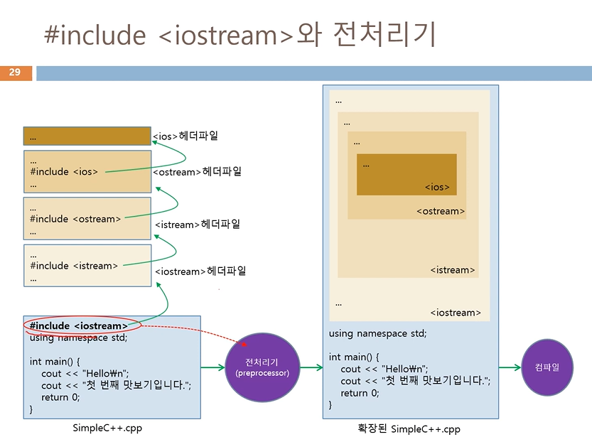

## 3주차 강의

### include <iostream>

- 전처리기 에게 내리는 지시
	- \<iostream> 헤더 파일을 컴파일 전에 소스에 확장하도록 지시

- \<iostream> 헤더 파일
	- 표준 입출력을 위한 클래스와 객체, 변수 등이 선언됨
		- ios, istream, ostream, iostream 클래스 선언
		- cout, cin, <<, >> 등 연산자 선언

### 이름 충돌 <br>
--------------

<br>
- namespace 키워드
	- 이름 충돌 해결
	- 개발자가 자신만의 이름 공간을 생성할 수 있도록 함
- 이름 공간 생성 및 사용
```cpp
namespace yena { // yena 라는 이름 공간 생성
	...... // 이 곳에 선언된 모든 이름은 yena 이름 공간에 생성된 이름
}
```
- 이름 공간 사용
	- 이름공간::이름

### std:: 란?

- Cpp 표준에서 정의한 **이름 공간** 중 하나
	- \<iostream> 헤더 파일에 선언된 모든 이름: std 이름 공간 안에 있음
	- cout, cin, endl 등

- std 이름 공간에 선언된 이름을 접근하기 위해 std:: 접두어 사용

- std:: 생략
	- using namespace std;

### Enter 키를 칠 때 변수에 값 전달
- cin의 특징
	- 입력 버퍼를 내장하고 있음
	- Enter 키가 입력될 때까지 입력된 키를 입력 버퍼에 저장
		- 도중에 Backspace 키를 입력하면 입력된 키 삭제

- >> 연산자
	- <Enter> 키가 입력되면 비로소 cin의 입력 버퍼에서 키 값을 읽어 변수에 전달

### Cpp 문자열

1. C-스트링 방식 - '\0'로 끝나는 문자 배열
	- char name[6] = {'G','r','a','c','e','\0'};

2. string 클래스 이용 		
	- <string> 헤더 파일에 선언됨
	- 다양한 멤버 함수 제공, 문자열 비교, 복사, 수정 등

|C-스트링|string클래스|
|-----|--------|
|C 언어에서 사용한 함수 사용 가능(strcmp(), strlen(), strcpy() 등|C++ 표준 클래스|
|<cstring>이나 <string.h> 헤더 파일 include|문자열의 크기에 따른 제약 없음|
|<cstring>헤더 파일 사용이 바람직|문자열 복사, 비교, 수정 등을 위한 다양한 함수와 연산자 제공|
|스페이스바를 만나면 입력 종료|객체 지향적|
|cin.getline()로 공백이 낀 문자열 입력 가능|<string>헤더 파일에 선언|
|cin.getline(address, int size, '\n');|C-스트링보다 다루기 쉬움|

### include <iostream>와 전처리기
--------------


<br>
- iostream 파일은 확장자 없는 텍스트 파일
- 컴파일러가 설치된 폴더 아래 include 폴더에 존재
- 표준 C++ 헤더 파일은 확장자가 없다

|#include <헤더파일>|#include "헤더파일"|
|----------|-----------|
|컴파일러가 설치된 폴더에서 찾으라는 지시|개발자의 프로젝트 폴더나 개발자가 컴파일 옵션으로 지정한 include 폴더에서 찾도록 지시|


