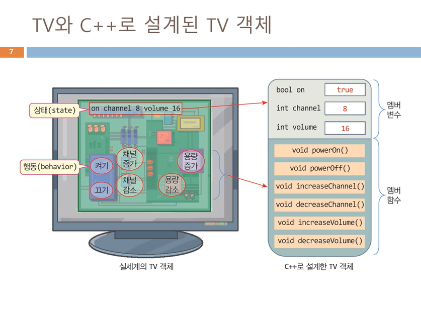
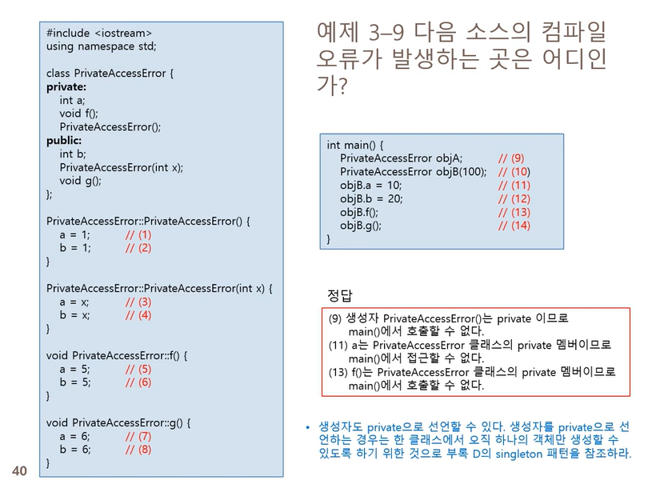

## 4주차 강의

### 객체와 캡슐화
- 객채는 캡슐화된다
	- 객체 내 데이터에 대한 보안, 보호, 외부 접근 제한

- 객체의 일부 요소는 공개된다
	- 외부와의 인터페이스를 위해 객체의 일부분 공개

### 멤버 함수와 멤버 변수
- 객체는 상태와 행동으로 구성

- TV객체 사례
	- 상태
		- on/off 속성
		- 채널
		- 음량
	- 행동
		- 켜기/끄기
		- 채널 증가/감소
-------------
 <br>

### Cpp 클래스와 Cpp 객체
----------------
|클래스|객체|
|--------|-------|
|객체를 만들어내기 위해 정의된 설계도, 틀|객체는 생성될 때 클래스의 모양을 그대로 가지고 탄생|
|클래스는 객체가 아님, 실체도 아님|메모리에 생성, 실체라고도 부름|
|멤버 변수와 멤버 함수 선언|멤버 변수와 멤버 함수로 구성|
||하나의 클래스 틀에서 찍어낸 여러 개의 객체 생성 가능|
||객체들은 상호 별도의 공간에 생성|

### Cpp 클래스 만들기
- 클래스 작성
	- 멤버 변수와 멤버 함수로 구성
	- 클래스 선언부와 클래스 구현부로 구성
- 클래스 선언부
	- class 키워드를 이용하여 클래스 선언
	- 멤버 변수와 멤버 함수 선언
		- 멤버 변수는 클래스 선언 내에서 초기화할 수 없음
		- 멤버 함수는 원형 형태로 선언
	- 멤버에 대한 접근 권한 지정
		- private, public, protected 중의 하나
		- 디폴트는 private
		- public: 다른 모든 클래스나 객체에서 멤버의 접근이 가능함을 표시
	- 클래스 구현부
		- 클래스에 정의된 모든 멤버 함수 구현
```cpp
#include <iostream>
using namespace std;

class Circle{
public:
	int radius;
	double getArea();
};

double Circle::getArea(){
	return 3.14*radius*radius;
}

int main () {
	Circle donut;
	donut.radius = 1;
	double area = donut.getArea();
	cout << "donut 면적은" << area << endl;

	Circle pizza;
	pizza,radius = 30;
	area = pizza.getArea();
	cout << "pizza 면적은" << area << endl;
}
```
### 생성자
- 객체가 **생성**되는 시점에서 **자동**으로 호출되는 **멤버 함수**
- 클래스 이름과 동일한 멤버 함수

### 생성자 함수의 특징
- 생성자의 목적
	- 객체가 생성될 때, 객체가 필요한 초기화를 위해
- 생성자 이름
	- **반드시 클래스 이름과 동일**
- **생성자는 리턴 타입을 선언하지 않는다**
- 객체 생성 시 오직 한 번만 호출
- 생성자는 중복 가능
- 생성자가 선언되어 있지 않으면 기본 생성자 자동으로 생성

### 위임 생성자
- 여러 생성자에 중복 작성된 코드의 간소화
	- 타겟 생성자와 이를 호출하는 위임 생성자로 나누어 작성
		- 타겟 생성자: 객체 초기화를 전담하는 생성자
		- 위임 생성자: 타겟 생성자를 호출하는 생성자, 객체 초기화를 타겟 생성자에 위임
---------------
### 다양한 생성자의 멤버 변수 초기화 방법

```cpp
class Point {
	int x, y;
public:
	Point();
	Point(int a, int b);
};
```
|생성자 코드에서 멤버 변수 초기화|생성자 서두에 초깃값으로 초기화|클래스 선언부에서 직접 초기화|
|-------|----------|----------|
|Point::point() {x = 0; y = 0;}|Point::Point() : x(0), y(0) {}|class Point {|
|Point::Point(int a, int b) { x = a; y = b; }|Point::Point(int a, int b)|int x = 0, y = 0;|
||	:x(a),y(b){}|public:|
|||....};|

### 기본 생성자

1. 기본 생성자는 꼭 있어야 하는가?
	- **C++ 컴파일러는 객체가 생성될 때, 생성자 반드시 호출**
2. 개발자가 클래스에 생성자를 작성해 놓지 않으면?
	- 컴파일러에 의해 기본 생성자가 자동으로 생성

- 기본 생성자란?
	- 클래스에 생성자가 하나도 선언되어 있지 않은 경우, 컴파일러가 대신 삽입해주는 생성자
	- 매개 변수 없는 생성자
	- 디폴트 생성자라고도 부름

### 소멸자
- 객체가 **소멸**되는 시점에서 **자동**으로 호출되는 함수
	- 오직 한번만 자동 호출, 임의로 호출할 수 없음
	- 객체 메모리 소멸 직전 호출됨

### 소멸자 특징
- 소멸자의 목적
	- 객체가 사라질 때 마무리 작업을 위함
	- 실행 도중 동적으로 할당 받은 메모리 헤제, 파일 저장 및 닫기, 네트위크 닫기 등
- 소멸자 함수의 이름은 클래스 이름 앞에 \~를 붙인다.
	- Circle::\~Circle(){ ... }
- 소멸자는 리턴 타입이 없고, 어떤 값도 리턴하면 안됨
- 중복 불가능
- 소멸자가 선언되지 않으면 기본 소멸자가 자동 생성
	- 기본 소멸자: 아무 것도 하지 않고 단순 리턴

**소멸자 작성 예제**
```cpp
class Circle {
public:
	int radius;

	Circle();
	Circle(int r);
	~Circle();
	double getArea();
};

Circle::Circle() {
	radius = 1;
}

Circle::Circle(int r) {
	radius = r;
}

Circle::~Circle() {
	cout << "반지름" << radius << "원 소멸" << endl;
}

double Circle::getArea() {
	return 3.14*radius*radius;
}
```
### 생성자/소멸자 실행 순서

||지역 객체|전역 객체|
|:-------:|-----|---------|
|실행 순서|함수 내에 선언된 객체로서, 함수가 종료하면 소멸|함수의 바깥에 선언된 객체로써, 프로그램이 종료할 때 소멸|
|**객체 생성 순서**|함수가 호출되는 순간에 순서대로 생성|프로그램에 선언된 순서로 생성|
|**객체 소멸 순서**|함수가 종료하면, 지역 객체가 생성된 순서의 역순으로 소멸|프로그램이 종료하면, 전역 객체가 생성된 순서의 역순으로 소멸|

|new를 이용하여 동적으로 생성된 객체의 경우|
|----------|
|new를 실행하는 순간 객체 생성|
|delete 연산자를 실행할 때 객체 소멸|

### 접근 지정자
- 캡슐화의 목적
	- 객체 보호, 보안
- 멤버에 대한 3가지 접근 지정자
	- private
		- 동일한 클래스의 멤버 함수에만 제한
	- public
		- 모든 다른 클래스에 허용
	- protected
		- 클래스 자신과 상속받은 자식 클래스에만 허용
--------------


### 인라인 함수
- inline 키워드로 선언된 함수

- 인라인 함수에 대한 처리
	- 인라인 함수를 호출하는 곳에 인라인 함수 코드를 확장 삽입
		- 메크로와 유사
		- 코드 확장 후 인라인 함수는 사라짐
	- 인라인 함수 호출
		- 함수 호출에 따른 오버헤드 존재하지 않음
		- 프로그램의 실행 속도 개선
	- 컴파일러에 의해 이루어짐

- 인라인 함수의 목적
	- C++ 프로그램의 실행 속도 향상
		- 자주 호출되는 짧은 코드의 함수 호출에 대한 시간 소모를 줄임
```cpp
inline int odd(int x) {
	return (x % 2);
}

int main () {
	int sum = 0;

	for(int i = 1; i < 10000; i++) {
		if(odd(i))
			sum += i;
	}
}
```

