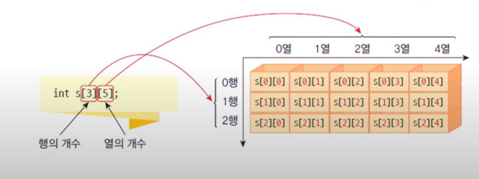

### 배열(array)
- 배열을 사용하면 한 번에 여러 개의 변수를 생성할 수 있다.
```c
자료형 배열이름[요소의개수];
int s[10];
```
- 인덱스: 배열 원소의 번호

### 배열 원소 접근
```c
scores[5] = 80
scores[1] = scores[0];
scores[i] = 100; // i 는 정수 변수
scores[index[3]] = 100; // index는 정수 배열
```
### 배열의 특징
- 배열은 반드시 연속된 메모리영역을 사용, 포인터는 아님
- 배열은 반복문을 사용하여 배열의 원소를 간편하게 처리할 수 있다
> 배열 난수로 채우기

### 잘못된 인덱스 문제
- 인덱스가 배열의 크기를 벗어나게 되면 프로그램에 치명적인 오류를 발생시킨다
- C에서는 프로그래머가 인덱스가 범위를 벗어나지 않았는지를 확인 하고 책임을 져야 한다
> 배열 원소의 개수 계산

### 배열의 복사
```c
int a[SIZE] = {1, 2, 3, 4};
int b[SIZE];
b = a; // 컴파일 오류
```

### 배열의 비교
> 배열 난수로 채우기
> 최솟값 찾기

### 배열과 함수
- 배열의 경우에는 사본이 아닌 원본이 전달된다

### 정렬, 탐색

### 선택정렬(selection sort)
--------------------
|왼쪽 배열| 오른쪽 배열| 설명|
|-------|--------|:-----:|
|()|(5,3,8,1,2,7)|초기상태|
|(1)| (5,3,8,2,7)|1선택|
|(1,2)| (5,3,8,7)|2선택|
|(1,2,3)|(5,8,7)|3선택|
|(1,2,3,5)|(8,7)|5선택}
|(1,2,3,5,7)|(8)|7선택|
|(1,2,3,5,7,8)|()|8선택|

- 쓸데없는 메모리의 누수

- 선택정렬
	- 정렬이 안된 숫자들중에서 최솟값을 선택하여 배열의 첫 번째 요소와 교환

> 선택정렬

### 탐색
- 순차 탐색
	- 순차탐색은 배열의 원소를 순서대로 하나씩 꺼내서 탐색키와 비교하여 원하는 값을 찾아가는 방법
- 이진 탐색
	- 턈색하려는 배열이 정렬이 되어 있어야 함
	- big(o) = log n
	
### 다차원 배열

- 배열을 함수의 인자로 넘길 땐 원본이 인자로 전달 됨

```cpp
int s[10] // 1차원 배열
int s[3][10] // 2차원 배열 
int s[5][3][10] // 3차원 배열
```



### 2차원 배열에서 인덱스

- **배열 index가 0에서 시작한다는 것에 주의**

### 2차원 배열의 초기화

1.
```cpp
int s[3][5] = {
 {0, 1, 2, 3, 4}, //첫 번쨰 행
 {10, 11, 12, 13, 14} //두 번째 행
 {20, 21, 22, 23, 24} // 세 번째 행
};
```
2.
```cpp
int s[][5] = {
 0, 1, 2, 3, 4, //첫 번쨰 행
 10, 11, 12, 13, 14 //두 번째 행
};
```
- 3행은 쓰레기 값

### 행렬

- 자연과학에서 많은 문제를 해결하는데 사용

### lab: 영상 처리
- 디지털 영상은 픽셀들의 2차원 배열이라 할 수 있다.