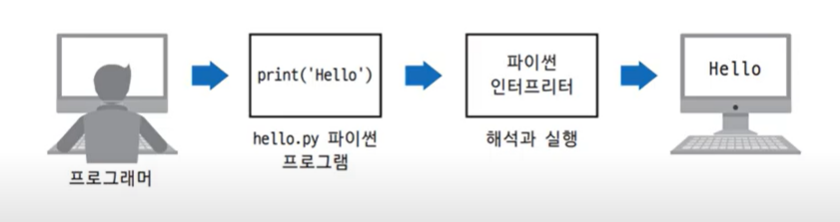
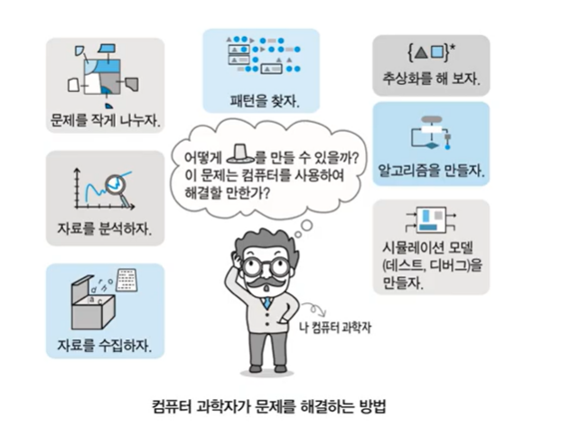

### 생활 속의 프로그램과 소프트웨어

|하드웨어|소프트웨어|운영체제|응용프로그램|
|-----|---------|---------|----------|
|컴퓨터와 스마트폰 정보통신 기계의 물리적 부품|하드웨어에서 구동되는 특정한 프로그램|응용 프로그램이 통작할 수 있도록 도와주는 컴퓨터 프로그램|하드웨어에서 수행될 한글, 파워포인트, 엑셀, 크롬 브라우저와 같은 응용 프로그램|
|중앙처리장치(혹은 CPU), 저장 장치, 출력장치, 입력장치 등으로 구성||하드웨어를 관리하여 응용 프로그램이 실행될 수 있는 환경을 제공||
|컴퓨터와 스마트폰, 태블릿 등||윈도우7, 윈도우8, 리눅스 등||

--------------------
|프로그램|프로그래밍|프로그래머|
|-----|------|--------|
|컴퓨터가 실행할 특정한 작업을 지시하는 일련의 명령어들의 모임|하나 이상의 명령어들을 입력하여 프로그램을 작성하는 과정|프로그램을 작성하는 사람|
|이 명령을 조직적으로 모아 놓은 것|다른 표현으로 '코딩'이라고 한다|컴퓨터에 명령을 내리는 명령어를 작성할 수 있어야 한다|
---------------

### 생활속의 프로그램과 소프트웨어

- 프로그래머는 hello.py라는 파이썬 프로그램을 작성
- 인터프리터는 프로그램이 hello.py를 기계어 명령어로 변환하여 컴퓨터에서 실행

### 컴퓨팅 사고
- 추상화
	- 복잡한 문제를 해결할 수 있는 상태로 만드는 일련의 과정
- 자동화
	- 추상화 된 문제를 자동화 기기를 통하여 해결할 수 있도록 만드는 과정	

### 변수의 타입

|객체 정의|뜻|자료 예시| 변수 설정 방법 예시|
|:---:|----|-----|------|
|int|integer, 정수|3 5 15 -24|a = 3|
|float|float, 부동소수점|3.2 4.55 -12.7|a = 3.2|
|str|string, 문자열|"abc", '문자열'|a = "abc"|
|bool|boolean, 불린|True, False|a = True|
|list|list, 리스트|[1, 2, 3, "list"]|a = [1, 2, 3, "list"]
|tuple|tuple, 튜플|(1, 2, 3, "tuple")|a = (1, 2, 3, "tuple")|
|dic|dictionary, 딕셔너리|{1: "name", 2: "phone"}|a = {1: "name", 2: "phone"}|
|set|set, 집합|{1, 2, 3, "set"}|a = {1, 2, 3, "set"}|

