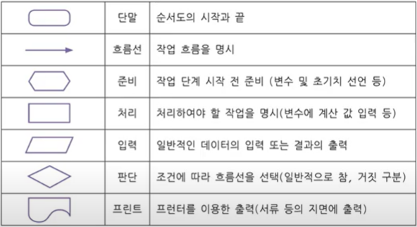

## 4,5,6주차 수업

### 좋은 개발자가 되기 위한 조건

1. Code Lay-out
- 인덴트: 공백으로 4칸 들여쓰기
- Blank Lines: 함수 및 클래스 정의 위에는 빈 2줄
2. 불필요한 공백 넣지 않기
3. Comments 간결하고 자세히 적기

### Naming Convention
- 키워드 \*를 사용하면 안
- 특수문자는 언더 바(\_)만 허용
- 숫자로 시작하면 안됨
- 공백을 포함할 수 없음

### 조건문 if-elif-else

```python
if 변수명 == 조건1:
	조건1이 참일 경우실행할 명령
elif: 변수명 == 조건2:
	조건2가 참일 경우 실행할 명령
else:
	모든 조건이 거짓일 경우 실행할 명령	
```
### 순서도와 의사코드



### 반복문 while

```python
while 반복조건(참):
	수행할 명령
```

### for 반복(iteration)
```python
a = ["호", "랑", "이"]
for i in a:
	print(i) # i 가 순서대로 "호" "랑" "이"로 변함
```
```python
for 변수명 in 리스트명:
	수행할 명령
```

### for - range()
----------
|용법|설명|포함된 숫자|
|-----|----|-----|
|range(5)|range(끝 숫자)|0, 1, 2, 3, 4|
|range(1, 5)|range(시작 숫자, 끝 숫자)|1, 2, 3, 4|
|range(1, 10, 2)|range(시작 숫자, 끝 숫자< 뛰어 세기)|1, 3, 5, 7, 9|

### continue, break

|continue|break|
|---------|---------|
|반복에서 스킵|반복에서 탈출|

### 터틀 라이브러리
- 라이브러리 불러오기
 - import 라이브러리 이름

### 라이브러리 이름 지정하기
- import turtle as t 라고 입력하면 t.forward(100)처럼 사용할 수 있다.

### 펜 옵션 사용하기

|명령어|설명|
|-------|----|
|forward()|앞으로 가기|
|back()|뒤로 가기|
|left()|왼쪽으로 ()도 만큼 회전|
|right()| 오른쪽으로 ()도 만큼 회전|
|goto()|해당 좌표로 이동하기|
|shape()|펜 모양|
|pensize()|펜 사이즈|
|pencolor()|펜 색|
|bgcolor()|배경 색|
|clear()|펜 지우기|
|reset()|펜의 위치와 화면 처음 상태로 되돌리기|
|write()|해당 위치에 글자를 쓴다|
|color()<br>begin_fill()<br>end_fill()|색을 설정해둔 뒤 도형이 만들어지면 도형에 색을 채운다|
|speed()|속도|
